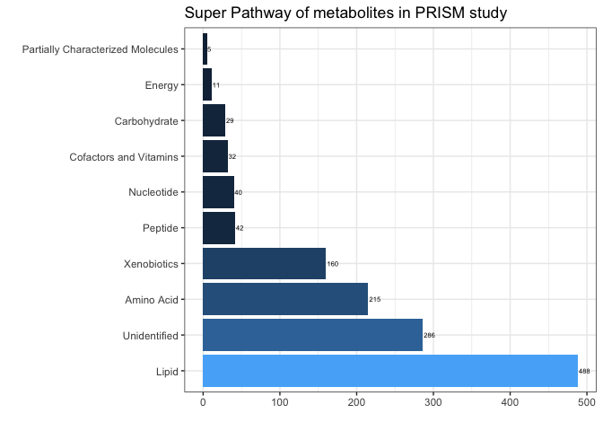

<br>


```r
library(readxl)                 # to read Excel files
library(tidyverse)              # for data manipulation
library(magrittr)               # for cleaning up column namess
library(reshape)                # for melting wide data to long data format
```
<br>


```r
metabolite = read_excel("data/MSSM-01-18ML+ CLIENT DATA TABLE 9.25.18.XLSX", 
                     sheet = "OrigScale", 
                     col_names = FALSE)
```

There are multiple identifiers associated with each metabolites.   
* Biochemical       
* Super Pathway      
* Sub Pathway      
* Platform       
* Chemical ID      
* PubChem       
* KEGG ID      

**Extract metabolite identifiers** 

```r
metabolite_IDs = metabolite[10:1317, 1:13] %>%
  set_colnames(metabolite[9, 1:13])

head(metabolite_IDs)
```

```
## # A tibble: 6 x 13
##   `PATHWAY SORTOR… BIOCHEMICAL `SUPER PATHWAY` `SUB PATHWAY` `COMP ID`
##   <chr>            <chr>       <chr>           <chr>         <chr>    
## 1 1441             (12 or 13)… Lipid           Fatty Acid, … 38293    
## 2 1444             (14 or 15)… Lipid           Fatty Acid, … 38768    
## 3 1448             (16 or 17)… Lipid           Fatty Acid, … 38296    
## 4 4599             (2,4 or 2,… Xenobiotics     Food Compone… 62533    
## 5 1668             (R)-3-hydr… Lipid           Fatty Acid M… 43264    
## 6 1669             (S)-3-hydr… Lipid           Fatty Acid M… 52984    
## # … with 8 more variables: PLATFORM <chr>, `CHEMICAL ID` <chr>, RI <chr>,
## #   MASS <chr>, PUBCHEM <chr>, CAS <chr>, KEGG <chr>, `Group HMDB` <chr>
```
<br>


```r
viz0 = fct_explicit_na(metabolite_IDs$`SUPER PATHWAY`, na_level = "Unidentified") %>%
    summary() %>%
    as.data.frame() %>%
    rownames_to_column(var = "Pathway") %>%
    set_colnames(c("Pathway", "Count"))

ggplot(viz0, aes(x = reorder(Pathway, -Count), y = Count)) + 
    geom_bar(stat = "identity", aes(fill = Count), show.legend = FALSE) + 
    coord_flip() + 
    geom_text(aes(label = Count), hjust = -0.10, color = "black", size = 2) + 
    theme_bw() + 
    labs(title = "Super Pathway of metabolites in PRISM study", x= "", y = "")
```

<!-- -->


```r
# metabolite identifiers
write.csv(metabolite_IDs, "data/1_metabolite-details.csv", row.names = FALSE)
```
