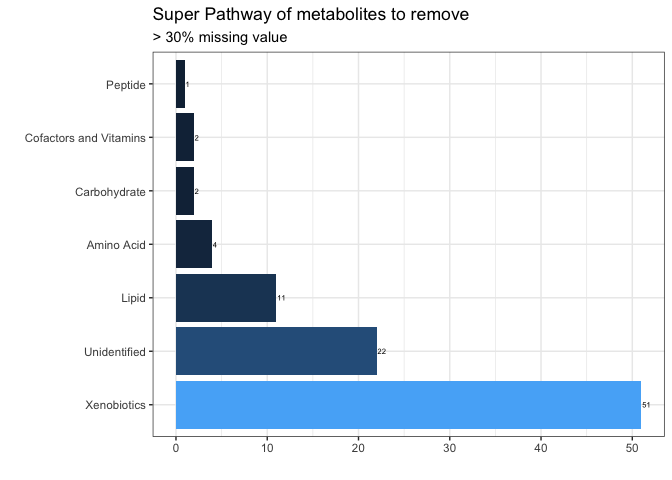

```r
library(readxl)                 # to read Excel files
library(tidyverse)              # for data manipulation
library(magrittr)               # for data manipulation
```


```r
metabolite = read_excel("data/MSSM-01-18ML+ CLIENT DATA TABLE 9.25.18.XLSX", 
                     sheet = "OrigScale", 
                     col_names = FALSE)
```
<br>


**1. Extract metabolite identifiers** 

```r
metabolite_IDs = metabolite[10:1317, 1:13] %>%
  set_colnames(metabolite[9, 1:13])

head(metabolite_IDs)
```

```
## # A tibble: 6 x 13
##   `PATHWAY SORTOR… BIOCHEMICAL `SUPER PATHWAY` `SUB PATHWAY` `COMP ID`
##   <chr>            <chr>       <chr>           <chr>         <chr>    
## 1 1441             (12 or 13)… Lipid           Fatty Acid, … 38293    
## 2 1444             (14 or 15)… Lipid           Fatty Acid, … 38768    
## 3 1448             (16 or 17)… Lipid           Fatty Acid, … 38296    
## 4 4599             (2,4 or 2,… Xenobiotics     Food Compone… 62533    
## 5 1668             (R)-3-hydr… Lipid           Fatty Acid M… 43264    
## 6 1669             (S)-3-hydr… Lipid           Fatty Acid M… 52984    
## # … with 8 more variables: PLATFORM <chr>, `CHEMICAL ID` <chr>, RI <chr>,
## #   MASS <chr>, PUBCHEM <chr>, CAS <chr>, KEGG <chr>, `Group HMDB` <chr>
```
<br>


**2. Extract metabolite concentrations**      

Of all the metabolite identifiers, "COMP ID" has the most complete data so we are going to use it to extract our metabolite information. It is an arbitary value assigned to the metabolites for identification. But since it is the most complete data, 

```r
# transpose the information because this is going to be used as column names
compID = metabolite[c(9:1317), 5] %>% t()
```
<br>

We are using the Assay ID as participant identifier (in rows) and COMP ID as metabolite identifiers (in columns). We can match Assay ID with the studyID from the covariate data to merge and create a complete participant history file.  

```r
df_compID = metabolite[c(3, 10:1317), 14:513] %>%
    t() %>%
    as_tibble() %>%
    set_colnames(compID)
colnames(df_compID)[1] = "Assay"
```
In genetic datasets the participants IDs are in rows and the metabolites are in columns. So, we tranpose our dataset to follow that convention. This is the general rule when the number of variables are greater than the number of participants (n > p).  
<br> 


**3. Find and remove metabolites with >30% missing data**

If a metabolites has more than 30% missing value, imputing the data would affect its overall data quality. So, we should consider removing them. 

```r
# remove Assay ID
# make sure all the data is numeric, in order to count the missing values
df <- df_compID[, -1] %>%
    mutate_if(is.character, as.numeric) 

# select a threshold value: 30% of the total metabolites
# the number of missing values for each metabolite should be lower than the 30% threshold
n = ncol(df)*0.30

# subset data with less than 30% missing values
# removed 93 metabolites
df_clean = subset(df, select = colSums(is.na(df))< n) %>%
    cbind(Assay = df_compID$Assay, .)
```
<br>

**3.1. Explore metabolites with >30% missing value**

Add metabolite identifiers to the 93 metabolites that we are looking to drop.        

```r
missing30 = subset(df, select = colSums(is.na(df)) > n) %>% colnames()

id_missing30 <- match(missing30, metabolite_IDs$`COMP ID`)
df_missing30 = metabolite_IDs[id_missing30, ]
```


```r
viz0 = fct_explicit_na(df_missing30$`SUPER PATHWAY`, na_level = "Unidentified") %>%
    summary() %>%
    as.data.frame() %>%
    rownames_to_column(var = "Pathway") %>%
    set_colnames(c("Pathway", "Count"))

ggplot(viz0, aes(x = reorder(Pathway, -Count), y = Count)) + 
    geom_bar(stat = "identity", aes(fill = Count), show.legend = FALSE) + 
    coord_flip() + 
    geom_text(aes(label = Count), hjust = -0.10, color = "black", size = 2) + 
    theme_bw() + 
    labs(title = "Super Pathway of metabolites to remove", subtitle = "> 30% missing value",  x= "", y = "")
```

<!-- -->
_Note_: Most of the metabolites with $>30\%$ missing value are Xenobiotics. If you are interested in those pathway, you can choose to keep them. It is important to explore the data before dropping them. 
<br>


```r
# metabolite concentrations with COMP ID column and Assay ID rows
write.csv(df_compID, "data/2_metabolites.csv", row.names = FALSE)
write.csv(df_missing30, "data/2_metabolites-removed.csv", row.names = FALSE)
write.csv(df_clean, "data/2_metabolites-clean.csv", row.names = FALSE)
```
